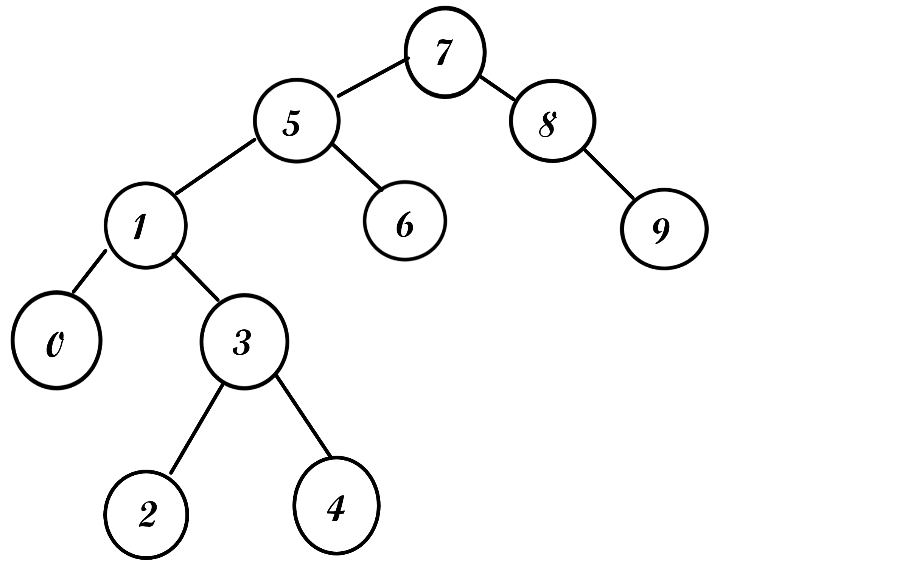

##[7,5,1,8,3,6,0,9,4,2] dizisinin Binary-Search-Tree aşamalarını yazınız.
Dizinin başındaki 7 root olarak seçilir.
1-) 5 elemanı 7'den küçük olduğu için sol tarafa yazılır.
2-) 1 elemanı 7 ve 5'den küçük olduğu için ikisininde sol tarafa yazılır.
3-) 8 elemanı 7'den büyük olduğu için sağ tarafa yazılır.
4-) 3 elemanı 7 ve 5'in solundan 1'in sağına galecek şekilde yazılır.
5-) 6 elemanı 7'in solundan 5'in sağına yazılır.
6-) 0 elemanı 7 ve 5 solundan 1'in soluna yazılır.
7-) 9 elemanı 7'in sağından 8'in sağına yazılır.
8 -) 4 elemanı 7 ve 5'in solundan 1'in sağından 3'ün sağına yazılır.
9-) 2 elemanı 7 ve 5'in solundan 1'in sağından 3'ün soluna yazılır.
***

***